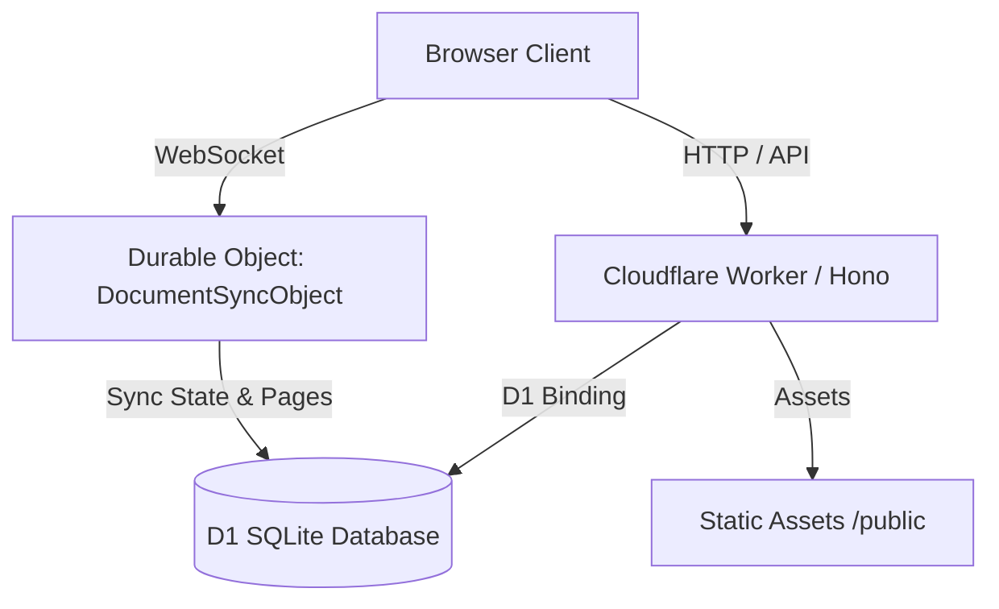

# SyncroEdit (Cloudflare-Native)

SyncroEdit is a high-performance, real-time collaborative document editor rebuilt as a **Cloudflare-native backend** with a minimalist "Dark OLED" design. It uses Conflict-free Replicated Data Types (CRDTs) via **Yjs** and WebSockets coordinated by **Durable Objects** to provide zero-conflict, real-time multi-user editing.

---

## Architecture Overview

SyncroEdit is deployed completely on Cloudflare's serverless edge architecture:



- **Cloudflare Worker (Hono):** Handles all HTTP routing, user authentication, profile details, and document CRUD API endpoints.
- **Cloudflare D1:** Acts as the primary SQL relational database to store users, sessions, documents, and permissions.
- **Durable Objects (`DocumentSyncObject`):** Represents individual document collaboration rooms. Manages WebSocket connections, state vectors, Yjs sync steps, cursor awareness propagation, and debounces state flushes back to D1.
- **Static Assets:** Served directly from the `./public` directory via Wrangler's assets binding.

---

## Tech Stack & Core Libraries

- **Frontend:** Vanilla JavaScript (ES Modules), Quill.js (Rich text editor), Yjs (Sync engine), `y-websocket` (WebSocket provider).
- **Backend Worker:** Hono Router, Web Crypto APIs for JWT/password hashing, Durable Objects.
- **Database:** Cloudflare D1 (SQLite).

---

## Required Cloudflare Bindings & Secrets

To run SyncroEdit in production, configure the following bindings in your Cloudflare dashboard or `wrangler.toml`:

### Bindings

1. **D1 Database:** Bind a D1 database to `DB`.
2. **Durable Objects:** Bind the class `DocumentSyncObject` to `DOCUMENT_SYNC_OBJECT`.

### Secrets

Set the following secret using wrangler CLI:

```bash
wrangler secret put JWT_SECRET
npx wrangler secret put RESEND_API_KEY
npx wrangler secret put EMAIL_CODE_PEPPER
```

Configure these email settings for verification-code delivery:

```txt
RESEND_API_KEY=wrangler secret
EMAIL_CODE_PEPPER=wrangler secret
EMAIL_FROM="SyncroEdit <no-reply@syncroedit.online>"
APP_NAME="SyncroEdit"
```

_Note: `JWT_SECRET` is used for signing/verifying session access tokens and short-lived WebSocket connection tickets. `EMAIL_CODE_PEPPER` is used to hash one-time email verification codes before storing them in D1._

---

## Development Setup

### 1. Install Dependencies

```bash
npm install
```

### 2. Apply Database Migrations (Local)

Create the local SQLite database and apply the schema:

```bash
npm run db:migrate:local
```

### 3. Start Local Development Server

Launch wrangler's local dev server (which emulates D1 and Durable Objects locally):

```bash
npm run dev
```

Open `http://localhost:8787` in your browser.

---

## CLI Commands

> [!NOTE]
> There is no `npm run build` script in this repository. Static assets are served directly from the `public/` directory by Cloudflare.

| Command                     | Description                                                                             |
| --------------------------- | --------------------------------------------------------------------------------------- |
| `npm run dev`               | Runs the wrangler dev emulator on `http://localhost:8787`                               |
| `npm run deploy`            | Deploys the Worker and static assets using `npx wrangler deploy --config wrangler.toml` |
| `npm run db:migrate:local`  | Applies migrations to the local development D1 database                                 |
| `npm run db:migrate:remote` | Applies migrations to the production remote D1 database                                 |
| `npm test`                  | Runs the Jest test suite (unit, integration, and frontend)                              |
| `npm run lint`              | Runs the ESLint checker                                                                 |
| `npm run format`            | Standardizes codebase formatting via Prettier                                           |

---

## Testing

The tests run using Jest and Hono's lightweight request testing harness combined with a stateful D1 mock database.

To execute tests:

```bash
npm test
```

---

## Production Boundary

SyncroEdit's production backend is the Cloudflare Worker in `src-worker/`. API routes, D1 access, session handling, and Durable Object realtime rooms all run in Cloudflare. Static assets are served from `./public` through Wrangler's assets binding.

### Live URLs

| URL                                                | Purpose                       |
| -------------------------------------------------- | ----------------------------- |
| **<https://syncroedit.online>**                    | Production (custom domain)    |
| **<https://www.syncroedit.online>**                | Production www redirect       |
| `https://syncroedit.jordanvorster404.workers.dev`  | Worker fallback (workers.dev) |

### Production DNS and Security Controls

Keep the Cloudflare zone, Resend domain, and Worker settings aligned before deploying production email or security changes:

- Resend is the active outbound email provider. `EMAIL_FROM` must use a sender verified for `syncroedit.online`.
- Keep exactly one root SPF TXT record and exactly one `_dmarc` TXT record. Copy SPF, DKIM, MX, and provider verification records from the Resend domain Records tab instead of guessing provider values.
- Route `security@syncroedit.online` and `dmarc@syncroedit.online` to monitored mailboxes before publishing them in `security.txt` or DMARC `rua`.
- Serve the contact policy at `https://syncroedit.online/.well-known/security.txt`; `https://syncroedit.online/security.txt` is kept as a compatibility copy.
- Production Cloudflare SSL/TLS should stay on a secure mode, with Always Use HTTPS enabled after HTTPS validates. Enable HSTS without preload or subdomain coverage until all hostnames are confirmed HTTPS-ready.
- Bot controls should protect the app without challenging normal users, API requests, WebSocket sync, or trusted crawlers/monitors. Prefer scoped Super Bot Fight Mode rules when available.

---

## Follow-up / Future Work

- **Turnstile Integration:** Optionally integrate Cloudflare Turnstile on the signup/login pages for DDoS protection.
- **Document Exporter:** Add export to PDF/Docx directly using Worker-compatible libraries if needed in the future.
